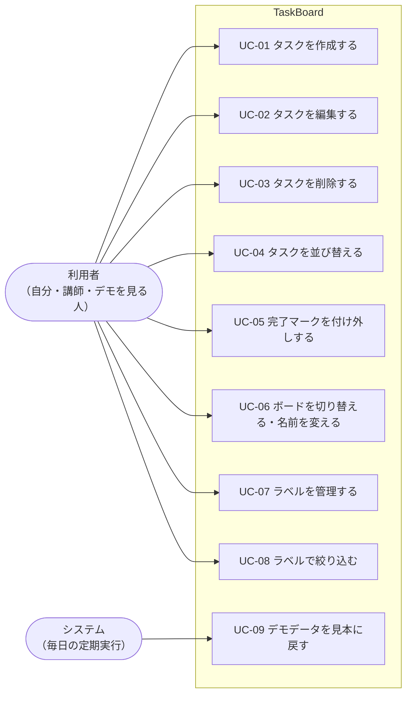
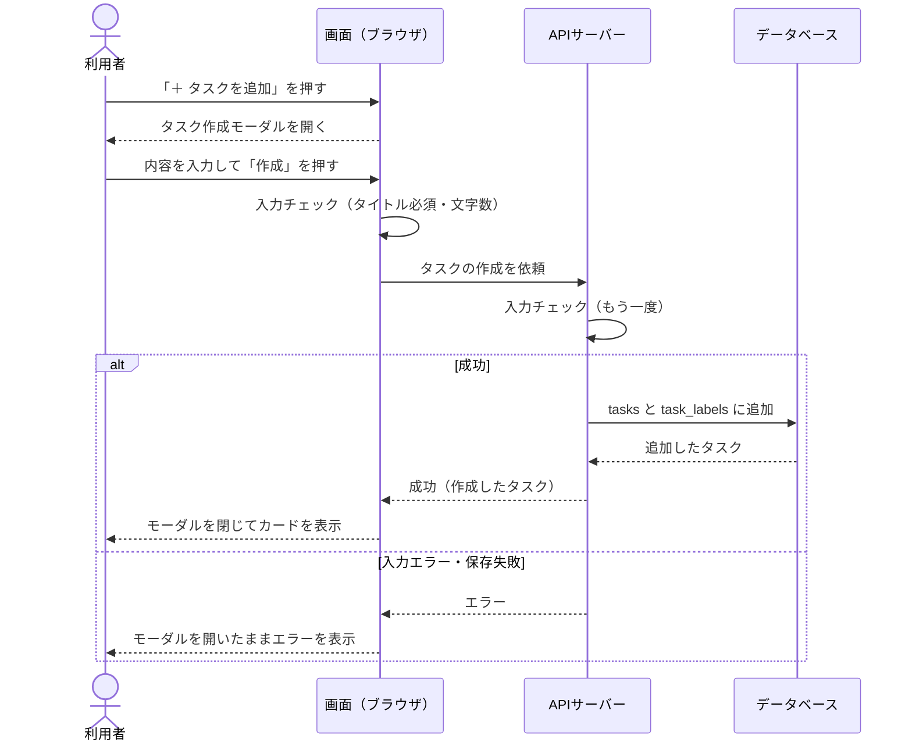
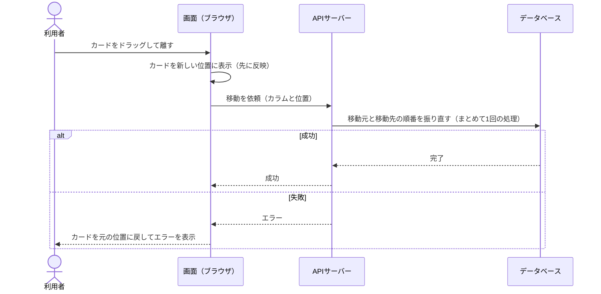
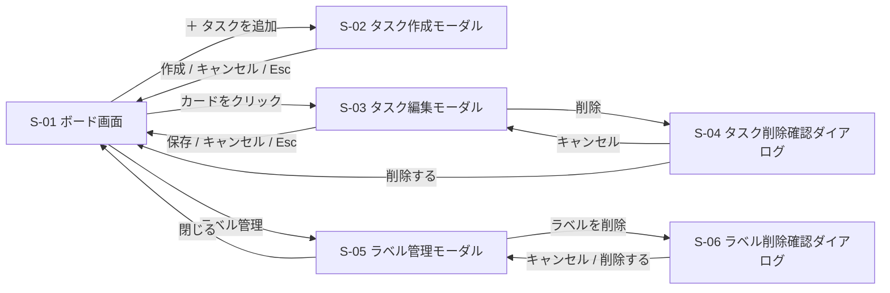
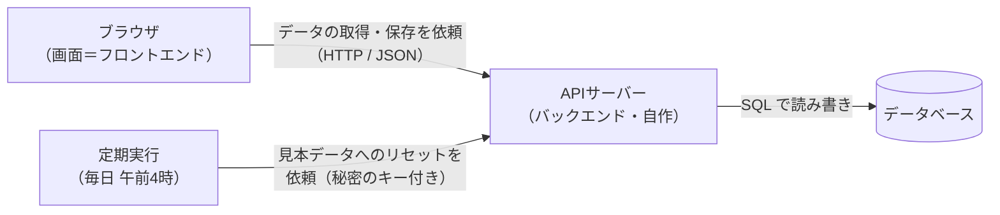
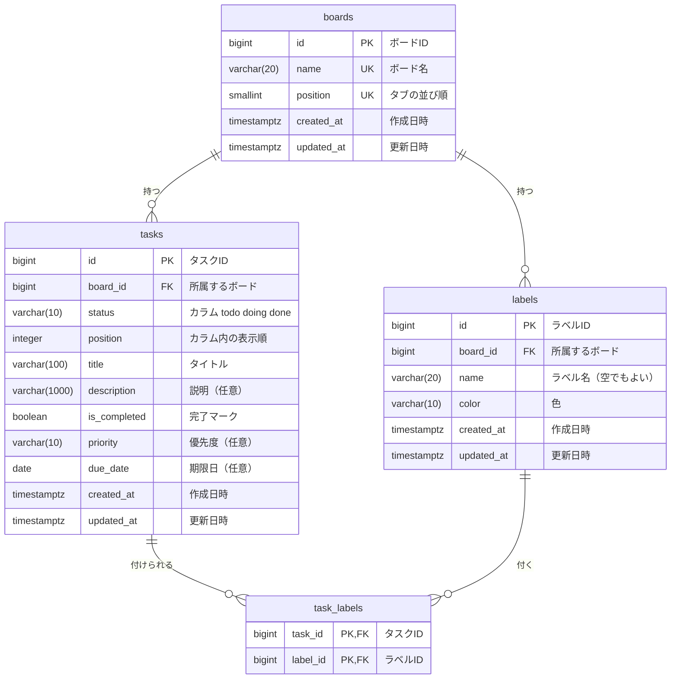

# 要件定義書：TaskBoard（Trello風タスク管理アプリ）

| 項目 | 内容 |
|---|---|
| アプリ名 | TaskBoard |
| バージョン | v2.0 |
| 作成日 | 2026-09-24 |
| 更新日 | 2026-10-05 |
| ステータス | 確定（決めたことの一覧は「11. 決定事項」） |
| 作成者 | Fujisawa（Claude Code と作成） |

> 💡 **要件定義書とは**
> 「何を作るか」「どこまで作るか」を、作り始める前に文章で決めておく設計図の最初の1枚。
> ここが曖昧だと、実装中に「これどうするんだっけ？」が大量に発生する。
> AIに実装を頼むときもこの文書を渡せば、指示がブレにくくなる。

---

## 1. プロジェクトの背景・目的

### 1.1 背景

- AIエンジニアコース（スクール）初級編の**課題1作目**として作るアプリである。
- プログラミングの文法から学ぶのではなく、実際の開発現場と同じく**上流工程（要件定義・設計）から**始めて、完成・公開までを自分で進めることがこの課題のねらい。
- 題材には、身近で機能のイメージがしやすい「Trello風のタスク管理アプリ（カンバンボード）」を選んだ。

### 1.2 目的

| 種類 | 目的 |
|---|---|
| **学習（主目的）** | 要件定義 → 設計 → 実装 → テスト → 公開を一通り体験する。画面（フロントエンド）・サーバー（バックエンド）・データベースを自分で作り、つながる仕組みを理解する。AIに指示を出しながら開発する進め方を身につける |
| **成果物** | 誰でも触れる公開デモとして、ポートフォリオに載せられる形に仕上げる |
| **アプリとして** | タスクを「未着手 → 作業中 → 完了」の流れで見える化し、今やるべきことを一目で把握できるようにする |

### 1.3 前提・制約

- 学習目的の課題のため、**機能はしぼって確実に完成させる**ことを優先する。
- データはブラウザではなく**データベースに保存**する。データベースとやりとりするサーバー（バックエンド）も自分で作る。
- ログイン機能はなく、**全員が同じデータを見る**（マルチユーザー対応は今回しない）。そのためユーザーのテーブルも作らない。
- 公開デモは誰でも書き換えられる前提で作り、**毎日見本データに戻す**。本物の予定や個人情報は入れない。

### 1.4 最初の構想と、この文書での扱い

| あなたの構想 | この文書での扱い | 対応する要件 |
|---|---|---|
| ラベルで色分けしたい | 6色から選べるラベル。名前も付けられる。1つのタスクに複数付けられる | F-40〜F-45 |
| ブラウザを閉じても稼働させたい | データベースに保存する。ブラウザを閉じても、別のブラウザやPCから開いても同じデータが見られる | F-50〜F-53 |
| 完了したらドラッグだけでなくチェックも付けたい | カラムの位置とは別に、任意で ✓ を付け外しできる。チェックしてもカードは移動しない（Q2） | F-30〜F-33 |

---

## 2. 利用者と利用シーン

- **利用者**
  - 自分（開発者・学習者）：自分のPCで動かして開発・動作確認する
  - 公開デモを触る人（講師・採点者・ポートフォリオを見る人）：公開URLを開いて自由に操作する
- ログインはなく、公開デモでは訪問者全員が同じデータを見て操作する。
- **主に使う端末**：PC（スマホは表示が崩れない程度に対応）。
- **利用シーン例**
  1. 講師が公開URLを開くと、見本のタスクが入った「仕事」ボードが表示される
  2. 「＋ タスクを追加」から作成モーダルを開き、タイトル・期限・ラベルを入れてタスクを作る
  3. タスクを「作業中」へドラッグし、「優先度順」ボタンで並べ直す
  4. 終わったタスクに ✓ を付ける、または「完了」へドラッグする
  5. 上部のタブで「プライベート」ボードに切り替えて操作する
  6. 翌日の朝には、デモのデータが見本の状態に戻っている

---

## 3. 用語の定義

| 用語 | 意味 |
|---|---|
| タスク | やることの1件。データベースに保存される単位 |
| カード | タスクをボード上に表示したもの |
| ボード | カラムが横に並ぶ1枚の板。「仕事」「プライベート」の2枚がある（名前は変更できる） |
| カラム | ボードの中の縦の列。「未着手」「作業中」「完了」の3つ（Trelloでは「リスト」と呼ぶ） |
| ラベル | タスクに付ける色付きの目印（例：赤＝緊急）。ボードごとに別々に持つ |
| チェック（完了マーク） | タスクに付ける ✓。カラムの位置とは別の「終わった」印 |
| モーダル | 画面の上に重ねて開く小窓。開いている間は後ろの画面を操作できない |
| D&D | ドラッグ＆ドロップ。マウスでつかんで移動する操作 |
| 整列 | ボタン1つでカラム内のタスクを「優先度順」や「期限順」に並べ直すこと |
| フロントエンド | ブラウザに表示される画面の部分 |
| バックエンド（APIサーバー） | 画面からの依頼を受けて、データベースを読み書きするサーバー。今回は自作する |
| データベース（DB） | データを表（テーブル）の形で保存する仕組み |
| テーブル／列 | データベースの表と、その項目。**ボードの「カラム」と混ざらないよう、この文書ではテーブルの項目を「列」と呼ぶ** |
| 主キー（PK）／外部キー（FK） | 主キー＝行を1つに特定する番号。外部キー＝別のテーブルの行を指す番号 |
| ER図 | テーブル同士のつながりを表した図 |
| 公開デモ | ネットに公開し、誰でも触れるようにしたTaskBoard |
| 見本データ | 公開デモの初期状態として入れておくボード・ラベル・タスク |
| MVP | Minimum Viable Product。まず動く最小限の完成形 |

---

## 4. スコープ（作るもの・作らないもの）

> 💡 最初から全部作ろうとすると完成しない。優先度を4段階（MoSCoW法）で分ける。

| 区分 | 意味 | 主な内容 |
|---|---|---|
| **Must** | 必須（MVP） | 2つのボードの切り替え・名前変更、3カラム表示、タスクの作成（モーダル）・編集・削除、D&D、チェック、ラベル、データベースへの保存、公開デモの案内表示、毎日の見本データへのリセット |
| **Should** | できれば今回 | 優先度、期限日、整列ボタン、ラベル絞り込み、件数表示、前回のボードを開く |
| **Could** | 余裕があれば | カラム追加、期限切れの強調、キーワード検索、タッチ操作、ダークモード、アーカイブ |
| **Won't** | 今回は作らない | ログイン・ユーザー管理、ボードの追加・削除、ボード間のタスク移動、タスク内のチェックリスト、コメント、添付ファイル、繰り返しタスク、操作の取り消し（Undo）、エクスポート・インポート、他の人の変更のリアルタイム反映、通知、スマホアプリ、英語表示 |

- エクスポート・インポートは v1 では Should だったが、公開デモでは誰でも全データを置き換えられてしまうため、作らないことにした。

---

## 5. 機能要件

> 💡 「ユーザーが何をできるか」の一覧。IDを振っておくと、後で「F-10 を実装して」とAIに指示できる。

### 5.1 ボード・カラム

| ID | 機能 | 優先度 | 詳細 |
|---|---|---|---|
| F-01 | ボード表示 | Must | 選んでいるボードの3カラム（未着手／作業中／完了）を横並びで表示する |
| F-02 | ボード切り替え | Must | 画面上部のタブで「仕事」「プライベート」を切り替える。タスク・ラベルはボードごとに別々 |
| F-03 | ボード名の変更 | Must | タブの名前をダブルクリックして変更する。1〜20文字。初期名は「仕事」「プライベート」 |
| F-04 | 前回のボードを開く | Should | 次に開いたとき、そのブラウザで最後に見ていたボードを表示する（この情報だけはブラウザに保存する。8.6 参照） |
| F-05 | カラムの件数表示 | Should | カラム見出しに件数を出す（例：「作業中 (3)」） |
| F-06 | カラムの追加・名前変更・削除 | Could | 今回はカラムを3つの固定値（todo／doing／done）で管理する。追加するときはカラム用のテーブルを新しく作る |

- ボードは2つで固定。追加・削除はできない（Q5）。

### 5.2 タスク

| ID | 機能 | 優先度 | 詳細 |
|---|---|---|---|
| F-10 | タスク作成 | Must | 各カラム下の「＋ タスクを追加」を押すとタスク作成モーダル（S-02）が開く。タイトル・説明・カラム・優先度・期限・ラベルをまとめて入力し、「作成」で保存する（Q20） |
| F-11 | タスク編集 | Must | カードをクリックするとタスク編集モーダル（S-03）が開く。作成と同じ項目を編集でき、「保存」で反映、「キャンセル」で破棄する（Q14） |
| F-12 | タスク削除 | Must | 編集モーダルの「削除」から削除確認ダイアログ（S-04）を出し、「削除する」で削除する |
| F-13 | 優先度 | Should | 高／中／低／なし から選ぶ。カード上に表示 |
| F-14 | 期限日 | Should | カレンダーから日付を選ぶ。カード上に表示 |
| F-15 | 期限切れ・期限当日の強調 | Could | 期限切れは赤、当日は黄色で表示 |

- タスクは作ったボードに属する。もう一方のボードへは移動できない（Q13）。

### 5.3 ドラッグ＆ドロップ・並び替え

| ID | 機能 | 優先度 | 詳細 |
|---|---|---|---|
| F-20 | カラム間の移動 | Must | カードをつかんで、同じボードの別のカラムへ移動する |
| F-21 | カラム内の並び替え | Must | 同じカラムの中で上下の順番を入れ替える |
| F-22 | ドラッグ中の見た目 | Should | つかんだカードに影を付け、落とす位置にガイドを出す |
| F-23 | 整列ボタン | Should | カラム見出しの「⋯」メニューから「優先度順」「期限順」を選ぶと、そのカラムのタスクを並べ直す（ルールは下記） |
| F-24 | タッチ操作 | Could | スマホ・タブレットの指でも D&D できる |

**整列のルール（F-23）**

| 整列 | 並ぶ順番 | 同じ値のとき |
|---|---|---|
| 優先度順 | 高 → 中 → 低 → なし | 期限の早い順 |
| 期限順 | 期限の早い順。期限なしは一番下 | 優先度の高い順 |

- 整列は「その場で1回並べ直す」ボタン。並べ直した順番は保存され、そのあとも D&D で自由に動かせる（Q9）。
- チェック済みのタスクは、上のルールに関係なく一番下にまとめる（その中の順番は同じルール）（Q15）。

### 5.4 チェック（完了マーク）

| ID | 機能 | 優先度 | 詳細 |
|---|---|---|---|
| F-30 | チェックの付け外し | Must | カード左側の丸いチェックボックスをクリックして切り替える。どのカラムにあっても付けられる |
| F-31 | チェック済みの見た目 | Must | ✓ を表示し、タイトルに取り消し線を引き、カード全体を少し薄くする |
| F-32 | チェックとカラムは連動しない | Must | チェックしてもカードは移動しない。「完了」へ移動してもチェックは自動で付かない（Q2） |
| F-33 | チェック済みタスクの一括アーカイブ | Could | ✓ の付いたタスクをまとめてボードから片付ける |

### 5.5 ラベル（色分け）

| ID | 機能 | 優先度 | 詳細 |
|---|---|---|---|
| F-40 | ラベルの付け外し | Must | 作成・編集モーダルでラベルを選ぶ。1つのタスクに複数付けられる（Q3） |
| F-41 | ラベルの色 | Must | 決められた6色（緑・黄・オレンジ・赤・紫・青）から選ぶ |
| F-42 | ラベル名 | Must | ラベルに名前を付けられる（例：赤＝「緊急」）。名前なしでもよい |
| F-43 | ラベルの作成・編集・削除 | Must | ラベル管理モーダル（S-05）で、いま開いているボードのラベルを管理する。ラベルを削除すると、付いていたタスクからも外れる |
| F-44 | ラベルで絞り込み | Should | ラベルを複数選べ、どれか1つでも付いているタスクを表示する（Q16） |
| F-45 | 見本のラベル | Must | 見本データとして、各ボードに名前付きのラベルを6色用意しておく（8.5 参照） |

- ラベルはボードごとに別々に持つ。「仕事」ボードのラベルは「プライベート」ボードには出てこない（Q12）。

### 5.6 データ保存・公開デモ

| ID | 機能 | 優先度 | 詳細 |
|---|---|---|---|
| F-50 | データベースへの保存 | Must | 変更するたびに APIサーバー経由でデータベースに保存する。モーダル以外に保存ボタンは置かない（Q18） |
| F-51 | 最新データの読み込み | Must | 画面を開いたとき、およびブラウザのタブに戻ってきたとき、サーバーから最新のデータを読み込む |
| F-52 | 読み込み中・接続エラーの表示 | Must | 読み込み中は「読み込み中」を表示する。サーバーにつながらないときはエラーと「再読み込み」ボタンを表示する |
| F-53 | 保存失敗の通知 | Must | 保存できなかったら画面にエラーを表示する（動きは R-23） |
| F-54 | 公開デモの案内表示 | Must | 画面上部に「公開デモです。誰でも編集でき、毎日午前4時に見本データへ戻ります。個人情報や本物の予定は入力しないでください」と常に表示する |
| F-55 | 見本データへの毎日のリセット | Must | 毎日午前4時（日本時間）に、すべてのデータを消して見本データに戻す（Q21） |

### 5.7 その他

| ID | 機能 | 優先度 | 詳細 |
|---|---|---|---|
| F-60 | キーワード検索 | Could | 開いているボードの中で、タイトル・説明の文字でタスクを絞り込む |
| F-61 | ダークモード | Could | 暗い配色に切り替える |

### 5.8 細かい動作ルール

> 💡 実装中に「この場合どうする？」となりやすい細かい動きを、先に決めておく。ここが空いていると、実装後の手直しの原因になる。

**タスクの作成・編集**

| ID | 場面 | ルール |
|---|---|---|
| R-01 | 作成する位置 | 新しいタスクは、作成モーダルで選んだカラムの一番下に入る |
| R-02 | 作成モーダルの初期値 | 「＋ タスクを追加」を押したカラムが「カラム」欄に最初から入っている。ほかの項目は空（優先度・期限・ラベルは「なし」、チェックなし） |
| R-03 | モーダルの閉じ方 | 「作成」「保存」で反映して閉じる。「キャンセル」・×ボタン・Esc で閉じると入力内容は破棄。モーダルの外をクリックしても閉じない（誤操作で消えるのを防ぐ）。タイトルが空のときは「作成」「保存」を押せない（Q14） |
| R-04 | 編集でカラムを変えたとき | 編集モーダルで「カラム」を変えて保存すると、移動先カラムの一番下に入る（D&D が使えない人のための代わりの手段にもなる） |
| R-05 | 入力の空白 | 前後の空白は取り除いて保存する。空白だけのタイトルは「空」として扱う |
| R-06 | 文字数の上限 | タイトル100文字・説明1000文字・ラベル名20文字・ボード名20文字。上限に達したら、それ以上は入力できない |
| R-07 | 説明文 | ただの文章として表示する（改行はそのまま）。太字などの装飾（Markdown）は使えない |

**カードの見た目**

| ID | 場面 | ルール |
|---|---|---|
| R-08 | カードに出す情報 | 上から「ラベル」「チェックボックス＋タイトル」「優先度・期限・説明ありマーク（📝）」。設定していないものは出さない |
| R-09 | ラベルの表示 | 色＋名前で表示する。名前のないラベルは色だけの帯で表示する |
| R-10 | 長いタイトル | 省略せず、折り返して全文を表示する |
| R-11 | 期限日 | 日付だけ（時刻はなし）。過去の日付も選べる。表示は「9/30」、今年以外は「2027/1/15」。あとから消すこともできる |

**チェック・削除**

| ID | 場面 | ルール |
|---|---|---|
| R-12 | チェックの操作 | カードを開かずに付け外しできる。チェックボックスを押しても編集モーダルは開かない |
| R-13 | タスクの削除 | 確認ダイアログに「このタスクを削除しますか？元に戻せません」とタスク名を出す。削除したタスクは元に戻せない |

**ドラッグ＆ドロップ・整列**

| ID | 場面 | ルール |
|---|---|---|
| R-14 | 空のカラム | タスクが1件もないカラムにもドロップできる |
| R-15 | ドロップ失敗 | カラムの外で手を離したら、カードは元の位置に戻る |
| R-16 | 整列の範囲 | 整列は、メニューを開いたカラムだけに対して行う |

**ラベル・絞り込み**

| ID | 場面 | ルール |
|---|---|---|
| R-17 | ラベルの数 | 1つのボードに最大20個。同じ色で複数作れる（例：赤「緊急」と赤「至急」）。ただし色も名前も同じラベルは作れない |
| R-18 | ラベルの削除 | 確認ダイアログ（S-06）に「このラベルは n 件のタスクから外れます」と出す |
| R-19 | 絞り込みの条件 | 何も選んでいないときは全部表示。複数選んだら、どれか1つでも付いているタスクを表示（Q16） |
| R-20 | 絞り込み中にできること | カードの表示・チェック・編集はできる。D&D・整列・タスクの作成はできない（隠れているタスクとの順番が決められないため）。絞り込み中であることを画面に表示する |
| R-21 | 絞り込み中の件数 | 「作業中 (2/5)」のように「表示中の件数／全体の件数」を出す |
| R-22 | 絞り込みの解除 | ボードを切り替えたとき、再読み込みしたときに解除する（絞り込み状態は保存しない） |

**ボード**

| ID | 場面 | ルール |
|---|---|---|
| R-23 | ボード名の変更 | ダブルクリックで入力欄になる。Enter で確定、Esc で取り消し。空のまま確定したら元の名前に戻る。もう一方のボードと同じ名前にはできない |

**保存・通信**

| ID | 場面 | ルール |
|---|---|---|
| R-24 | 保存のタイミング（2種類） | **D&D・チェック**：先に画面を変え、裏でサーバーに保存する。失敗したら元に戻してエラーを出す（操作が軽く感じられるようにするため）。**それ以外**（作成・編集・削除・ラベル・ボード名）：サーバーの成功を待ってから画面に反映する。待っている間はボタンを押せない（二重登録を防ぐ） |
| R-25 | エラーの表示 | 画面上部に赤いメッセージを数秒出す。モーダルで失敗したときは、モーダルを開いたままエラーを出し、入力内容は残す |
| R-26 | サーバーにつながらないとき | 画面に「サーバーに接続できません」と「再読み込み」ボタンを出す |
| R-27 | 他の人・他のタブの変更 | 自動では反映しない。ブラウザのタブに戻ってきたとき、または再読み込みしたときに最新を読み込む。同じタスクを同時に変えたら、後から保存したほうが残る |
| R-28 | 他の人が削除したタスクを操作したとき | 「このタスクはすでに削除されています」と出し、ボードを読み込み直す |
| R-29 | タスクの上限 | 1つのボードに最大200件。超えて作成しようとしたら「これ以上タスクを作成できません」と出す（公開デモでデータが増えすぎるのを防ぐ） |

**公開デモ**

| ID | 場面 | ルール |
|---|---|---|
| R-30 | 毎日のリセット | 毎日午前4時（日本時間）に、すべてのタスク・ラベル・ボード名を消して見本データに戻す。リセット中に操作した人にはエラーを出し、ボードを読み込み直す |
| R-31 | 画面の言葉 | 日本語のみ |

---

## 6. ユースケース・操作フロー

> 💡 「誰が・何をするか」（ユースケース）と、そのとき画面・サーバー・データベースの間で何が起きるか（操作フロー）を書く。実装やテストのときの手順書になる。

### 6.1 ユースケース一覧



| ID | ユースケース | 関係する機能 | 詳しい流れ |
|---|---|---|---|
| UC-01 | タスクを作成する | F-10 | 6.2 |
| UC-02 | タスクを編集する | F-11, F-13, F-14, F-40 | 6.3 |
| UC-03 | タスクを削除する | F-12 | 6.4 |
| UC-04 | タスクを並び替える（D&D・整列） | F-20〜F-23 | 6.5 |
| UC-05 | 完了マークを付け外しする | F-30〜F-32 | 5.4 と R-12、R-24 のとおり |
| UC-06 | ボードを切り替える・名前を変える | F-02〜F-04 | 5.1 と R-23 のとおり |
| UC-07 | ラベルを管理する | F-41〜F-43 | 5.5 と R-17、R-18 のとおり |
| UC-08 | ラベルで絞り込む | F-44 | R-19〜R-22 のとおり |
| UC-09 | デモデータを見本に戻す | F-55 | R-30 のとおり |

### 6.2 UC-01 タスクを作成する

| 項目 | 内容 |
|---|---|
| 利用者 | 利用者 |
| 始める前の状態 | ボード画面（S-01）が表示されている。絞り込みをしていない |
| 終わった後の状態 | 新しいタスクがデータベースに保存され、選んだカラムの一番下に表示されている |

**基本の流れ**

1. 利用者が、カラム下の「＋ タスクを追加」を押す
2. 画面が、タスク作成モーダル（S-02）を開く。「カラム」欄には押したカラムが入っている（R-02）
3. 利用者が、タイトル（必須）と、必要なら説明・カラム・優先度・期限・ラベルを入力し、「作成」を押す
4. 画面が入力内容をチェックし、サーバーに作成を依頼する。待っている間は「作成」を押せない
5. サーバーが入力内容をもう一度チェックし、データベースの `tasks`（と `task_labels`）に保存する
6. 画面が、モーダルを閉じて、カラムの一番下にカードを表示する

**うまくいかないときの流れ**

| 起きること | 動き |
|---|---|
| タイトルが空 | 「作成」が押せない（3で止まる） |
| ボードのタスクが200件ある | 「これ以上タスクを作成できません」と出す（R-29） |
| サーバーにつながらない・保存に失敗 | モーダルを開いたままエラーを出す。入力内容は残る（R-25） |
| 「キャンセル」・×・Esc | 何も保存せずにモーダルを閉じる |



### 6.3 UC-02 タスクを編集する

| 項目 | 内容 |
|---|---|
| 利用者 | 利用者 |
| 始める前の状態 | ボード画面に編集したいタスクのカードが表示されている |
| 終わった後の状態 | 変更した内容がデータベースに保存され、カードに反映されている |

**基本の流れ**

1. 利用者が、カードをクリックする
2. 画面が、タスク編集モーダル（S-03）を開き、今の内容を表示する
3. 利用者が、内容を書き換えて「保存」を押す
4. 画面が入力内容をチェックし、サーバーに更新を依頼する
5. サーバーが入力内容をもう一度チェックし、データベースを更新する（カラムを変えた場合は移動先の一番下に入れる：R-04）
6. 画面が、モーダルを閉じてカードの表示を更新する

**うまくいかないときの流れ**

| 起きること | 動き |
|---|---|
| タイトルを空にした | 「保存」が押せない |
| 「キャンセル」・×・Esc | 変更を捨ててモーダルを閉じる。カードは元のまま |
| 他の人がすでに削除していた | 「このタスクはすでに削除されています」と出し、ボードを読み込み直す（R-28） |
| サーバーにつながらない・保存に失敗 | モーダルを開いたままエラーを出す。入力内容は残る |

### 6.4 UC-03 タスクを削除する

| 項目 | 内容 |
|---|---|
| 利用者 | 利用者 |
| 始める前の状態 | タスク編集モーダル（S-03）が開いている |
| 終わった後の状態 | タスク（と付いていたラベルとの結び付け）がデータベースから消え、カードが画面から消えている |

**基本の流れ**

1. 利用者が、編集モーダルの「削除」を押す
2. 画面が、削除確認ダイアログ（S-04）を出す
3. 利用者が「削除する」を押す
4. 画面が、サーバーに削除を依頼する
5. サーバーが、`tasks` から削除する（`task_labels` の結び付けも一緒に消える）。同じカラムの残りのタスクの順番を詰める
6. 画面が、ダイアログと編集モーダルを閉じ、カードを消す

**うまくいかないときの流れ**

| 起きること | 動き |
|---|---|
| 確認ダイアログで「キャンセル」 | ダイアログだけ閉じて、編集モーダルに戻る |
| 他の人がすでに削除していた | 削除できたものとして扱い、ボードを読み込み直す |
| サーバーにつながらない・削除に失敗 | エラーを出す。カードは残る |

### 6.5 UC-04 タスクを並び替える

| 項目 | 内容 |
|---|---|
| 利用者 | 利用者 |
| 始める前の状態 | ボード画面が表示されている。絞り込みをしていない（R-20） |
| 終わった後の状態 | 新しい並び順がデータベースに保存されている |

**基本の流れ（D&D）**

1. 利用者が、カードをつかんで、移したい位置（同じカラム内、または別のカラム）で離す
2. 画面が、すぐにカードを新しい位置に表示する（先に画面を変える：R-24）
3. 画面が、サーバーに移動を依頼する（移動先のカラムと位置）
4. サーバーが、移動元と移動先のカラムのタスクの順番（`position`）を振り直す。途中で失敗して順番が壊れないよう、まとめて1回の処理（トランザクション）で行う

**基本の流れ（整列ボタン）**

1. 利用者が、カラム見出しの「⋯」から「優先度順」または「期限順」を選ぶ
2. 画面が、整列のルール（5.3）で並べ直して表示し、サーバーに新しい順番を送る
3. サーバーが、そのカラムのタスクの `position` をまとめて書き換える

**うまくいかないときの流れ**

| 起きること | 動き |
|---|---|
| カラムの外で離した | カードは元の位置に戻る。サーバーには何も送らない（R-15） |
| サーバーにつながらない・保存に失敗 | カードを元の位置に戻してエラーを出す |
| 絞り込み中 | D&D と整列はできない（R-20） |



---

## 7. 画面設計

> 💡 どんな画面があり、どう行き来するかを決める。色や余白などの細かい見た目は実装のときに調整する。

### 7.1 画面一覧

| ID | 画面 | 種類 | 役割 |
|---|---|---|---|
| S-01 | ボード画面 | ページ | メイン画面。ボードの切り替え、カラムとカードの表示、D&D、チェック、整列、絞り込みを行う |
| S-02 | タスク作成モーダル | モーダル | 新しいタスクの内容を入力して作成する |
| S-03 | タスク編集モーダル | モーダル | タスクの内容を編集する。削除の入り口もここ |
| S-04 | タスク削除確認ダイアログ | ダイアログ | 削除してよいか確認する |
| S-05 | ラベル管理モーダル | モーダル | 開いているボードのラベルを作成・編集・削除する |
| S-06 | ラベル削除確認ダイアログ | ダイアログ | ラベルを削除してよいか確認する |

- ボードの切り替え・ボード名の変更・D&D・チェック・整列・絞り込みは、画面を移らずに S-01 の中で行う。
- 「読み込み中」「サーバーに接続できません」「エラーメッセージ」は S-01 の中に表示する状態で、別の画面ではない。

### 7.2 画面遷移図



### 7.3 S-01 ボード画面

```
[公開デモです。誰でも編集でき、毎日午前4時に見本データへ戻ります。個人情報は入力しないでください]
TaskBoard    [ 仕事 ]  プライベート         [ラベルで絞り込み ▼] [ラベル管理]
-------------------------------------------------------------------------------
 未着手 (2)        ⋯     作業中 (1)        ⋯     完了 (1)          ⋯
+--------------------+  +--------------------+  +--------------------+
| [緊急] [請求]      |  | [学習]             |  | [請求]             |
| ○ 企画書を書く     |  | ○ React入門        |  | ✓ 請求書を送る     |
|   優先:高  〆9/30  |  |   〆10/5           |  |   （取り消し線）   |
+--------------------+  +--------------------+  +--------------------+
+--------------------+
| ○ 資料を印刷       |
+--------------------+
 ＋ タスクを追加         ＋ タスクを追加         ＋ タスクを追加
```

| 部品 | 内容 |
|---|---|
| 公開デモの案内 | 画面の一番上に常に表示（F-54） |
| ボードのタブ | `[ 仕事 ]` が選択中。もう一方をクリックで切り替え、ダブルクリックで名前変更（F-02, F-03） |
| ラベルで絞り込み | ラベルを複数選べる（F-44） |
| ラベル管理 | S-05 を開く |
| カラム見出し | カラム名と件数。`⋯` から整列（F-05, F-23） |
| カード | ラベル・チェックボックス・タイトル・優先度・期限・説明ありマーク（R-08）。クリックで S-03 |
| ＋ タスクを追加 | S-02 を開く。絞り込み中は表示しない（R-20） |

### 7.4 S-02 タスク作成モーダル／S-03 タスク編集モーダル

作成と編集は同じ入力フォームを使い、タイトルとボタンだけを変える。

```
+---------------------------------------------+
| タスクを作成                            [×] |
|                                             |
| タイトル（必須）                            |
| [                                         ] |
| 説明                                        |
| [                                         ] |
| [                                         ] |
| カラム   [ 未着手 ▼ ]                       |
| 優先度   [ なし ▼ ]    期限 [ 日付を選ぶ ]  |
| ラベル   [緊急] [請求] [会議] ...（複数可） |
|                                             |
|                      [キャンセル]  [ 作成 ] |
+---------------------------------------------+
```

| 項目 | 作成モーダル（S-02） | 編集モーダル（S-03） |
|---|---|---|
| 見出し | タスクを作成 | タスクを編集 |
| 入力欄の初期値 | 空（カラムだけ押した場所） | 今の内容 |
| 下のボタン | キャンセル／作成 | 削除／キャンセル／保存 |
| 入力欄 | タイトル（必須・100文字まで）、説明（1000文字まで）、カラム、優先度、期限、ラベル（複数選択） | 同じ |

### 7.5 S-04 タスク削除確認ダイアログ

```
+-------------------------------------+
| このタスクを削除しますか？          |
| 「企画書を書く」                    |
| 削除すると元に戻せません。          |
|             [キャンセル] [削除する] |
+-------------------------------------+
```

### 7.6 S-05 ラベル管理モーダル／S-06 ラベル削除確認ダイアログ

- S-05：開いているボードのラベルを一覧表示する。各ラベルの色と名前を変更でき、「＋ ラベルを追加」で新しく作れる（最大20個：R-17）。
- S-06：「このラベルは n 件のタスクから外れます。削除しますか？」と確認する（R-18）。

---

## 8. データ設計

> 💡 何をどんな形で保存するかを決める。ここを先に決めておくと、実装が楽になる。

### 8.1 方針

- データは**データベースに保存**する（v1 のブラウザ保存から変更：Q18）。
- 画面（フロントエンド）は、データベースに直接つながらない。**自作の APIサーバー（バックエンド）を通して**読み書きする。
- ログインはないので、**ユーザーのテーブルは作らない**。全員が同じデータを見る。
- テーブルは4つ：`boards`（ボード）、`tasks`（タスク）、`labels`（ラベル）、`task_labels`（タスクとラベルの結び付け）（Q19）。
- ボードのカラム（未着手／作業中／完了）は3つで固定なので、テーブルにせず `tasks.status` の値で表す。

### 8.2 システム構成図



### 8.3 ER図

- 1つのボードは、たくさんのタスクとラベルを持つ。
- タスクとラベルは「多対多」（1つのタスクに複数のラベル、1つのラベルは複数のタスクに付く）なので、間に `task_labels` を置いて結び付ける。



### 8.4 テーブル定義

> 型は PostgreSQL を想定して書いている。データベースの種類は技術選定で確定し、違う場合は型を読み替える。
>
> **型の読み方**：`BIGINT`＝大きな整数、`SMALLINT`／`INTEGER`＝整数、`VARCHAR(n)`＝最大 n 文字の文字列、`BOOLEAN`＝true／false、`DATE`＝日付、`TIMESTAMPTZ`＝タイムゾーン付きの日時。
> **NULL**：「値なし」を許すかどうか。

#### boards（ボード）

| 列名 | 型 | NULL | 初期値 | 説明・ルール |
|---|---|---|---|---|
| id | BIGINT | 不可 | 自動で採番 | 主キー |
| name | VARCHAR(20) | 不可 | | ボード名。1〜20文字。ほかのボードと同じ名前は不可（UNIQUE） |
| position | SMALLINT | 不可 | | タブの並び順（0＝左、1＝右）。UNIQUE |
| created_at | TIMESTAMPTZ | 不可 | 今の日時 | 作成日時 |
| updated_at | TIMESTAMPTZ | 不可 | 今の日時 | 更新日時 |

- 行は「仕事」「プライベート」の2行だけで、追加・削除はしない。

#### tasks（タスク）

| 列名 | 型 | NULL | 初期値 | 説明・ルール |
|---|---|---|---|---|
| id | BIGINT | 不可 | 自動で採番 | 主キー |
| board_id | BIGINT | 不可 | | 外部キー → `boards.id` |
| status | VARCHAR(10) | 不可 | `'todo'` | どのカラムにあるか。`todo`（未着手）／`doing`（作業中）／`done`（完了）のどれか（CHECK 制約） |
| position | INTEGER | 不可 | | カラム内の表示順。0 から始まる連番で、小さいほど上 |
| title | VARCHAR(100) | 不可 | | タイトル。1〜100文字。前後の空白は除いて保存 |
| description | VARCHAR(1000) | 可 | NULL | 説明。NULL＝説明なし |
| is_completed | BOOLEAN | 不可 | false | 完了マーク（✓）の有無 |
| priority | VARCHAR(10) | 可 | NULL | 優先度。`high`／`medium`／`low` のどれか（CHECK 制約）。NULL＝なし |
| due_date | DATE | 可 | NULL | 期限日（時刻なし）。NULL＝期限なし |
| created_at | TIMESTAMPTZ | 不可 | 今の日時 | 作成日時 |
| updated_at | TIMESTAMPTZ | 不可 | 今の日時 | 更新日時 |

- 索引（インデックス）：`(board_id, status, position)`。ボードを開いたとき、カラムごとに順番どおり速く取り出すため。
- 1つのボードのタスクは最大200件（R-29）。サーバー側でチェックする。

#### labels（ラベル）

| 列名 | 型 | NULL | 初期値 | 説明・ルール |
|---|---|---|---|---|
| id | BIGINT | 不可 | 自動で採番 | 主キー |
| board_id | BIGINT | 不可 | | 外部キー → `boards.id` |
| name | VARCHAR(20) | 不可 | `''`（空の文字） | ラベル名。0〜20文字。名前なしは空の文字で表す |
| color | VARCHAR(10) | 不可 | | `green`／`yellow`／`orange`／`red`／`purple`／`blue` のどれか（CHECK 制約） |
| created_at | TIMESTAMPTZ | 不可 | 今の日時 | 作成日時 |
| updated_at | TIMESTAMPTZ | 不可 | 今の日時 | 更新日時 |

- `(board_id, color, name)` の組み合わせは UNIQUE（同じボードに、色も名前も同じラベルは作れない：R-17）。
- 名前なしを NULL ではなく空の文字にするのは、NULL だと上の重複チェックが効かないため。
- 1つのボードのラベルは最大20個（R-17）。サーバー側でチェックする。

#### task_labels（タスクとラベルの結び付け）

| 列名 | 型 | NULL | 初期値 | 説明・ルール |
|---|---|---|---|---|
| task_id | BIGINT | 不可 | | 外部キー → `tasks.id`。タスクを削除したら、この行も一緒に消える（ON DELETE CASCADE） |
| label_id | BIGINT | 不可 | | 外部キー → `labels.id`。ラベルを削除したら、この行も一緒に消える（ON DELETE CASCADE）。これで「ラベルを消すとタスクからも外れる」が実現できる |

- 主キーは `(task_id, label_id)` の組み合わせ（同じラベルを同じタスクに2回付けられない）。
- タスクと同じボードのラベルしか付けられない。サーバー側でチェックする。

### 8.5 見本データ

公開デモの初期状態と、毎日のリセット後の状態（F-55）。

| テーブル | 中身 |
|---|---|
| boards | 「仕事」（position 0）、「プライベート」（position 1） |
| labels | 仕事：緊急（赤）・請求（黄）・会議（青）・資料（緑）・連絡（オレンジ）・学習（紫）<br>プライベート：大事（赤）・家事（黄）・健康（青）・買い物（緑）・趣味（オレンジ）・予定（紫） |
| tasks | 各ボードに5件程度。3つのカラムにばらけさせ、優先度・期限・ラベル・チェック済みの例を含める（具体的な中身は実装のときに決める） |

### 8.6 ブラウザに保存するもの

- 「最後に開いていたボードのID」だけは、データベースではなくブラウザ（localStorage）に保存する（F-04）。
- 理由：見る人ごとに違ってよい「表示の好み」であり、全員で共有するデータではないため。

---

## 9. 非機能要件

> 💡 「機能」以外の品質の約束。速さ・使える環境・安全性など。「（仮）」は目安の数字で、作りながら見直す。

### 9.1 対応環境

| ID | 項目 | 要件 |
|---|---|---|
| N-01 | 対応ブラウザ | Chrome・Edge・Safari の最新版。Firefox 最新版はできれば |
| N-02 | 画面サイズ | PC（幅1280px）を基準にする。スマホ幅（375px）でも崩れず、横スクロールでカラムを見られる |

### 9.2 性能

| ID | 項目 | 要件 |
|---|---|---|
| N-03 | 表示の速さ（仮） | 画面を開いてから表示まで3秒以内。ただし無料の公開先は、しばらくアクセスがないと休止し、次に開いたとき数十秒かかることがある（許容する） |
| N-04 | 操作の速さ（仮） | 作成・編集・削除は、ボタンを押してから1秒以内に画面に反映される。D&D・チェックは押した瞬間に画面が変わる（R-24） |
| N-05 | データ量 | 1つのボードにタスク200件あっても、表示・D&D がもたつかない |

### 9.3 データの保全

| ID | 項目 | 要件 |
|---|---|---|
| N-06 | 保存 | データはデータベースに保存され、ブラウザを閉じても、別のブラウザから開いても残っている |
| N-07 | 公開デモ | 毎日午前4時（日本時間）に見本データに戻す。それ以外のバックアップは取らない |
| N-08 | 開発用のデータ | 自分のPCで動かすときは、公開デモとは別のデータベースを使う |

### 9.4 セキュリティ

| ID | 項目 | 要件 |
|---|---|---|
| N-09 | 誰でも編集できる前提 | ログインがないため、公開デモは誰でも見て書き換えられる。案内表示（F-54）で、個人情報や本物の予定を入れないよう伝える |
| N-10 | XSS 対策 | 入力された文字はただの文字として表示し、HTMLとして実行しない |
| N-11 | SQL インジェクション対策 | SQL は「プレースホルダ（パラメータ化クエリ）」で組み立て、入力された文字をそのまま SQL に混ぜない |
| N-12 | サーバー側の入力チェック | 画面のチェックだけに頼らず、サーバーでも必須・文字数・選べる値・件数の上限・同じボードかどうかをチェックする |
| N-13 | 書き込みの回数制限（仮） | 同じ接続元からの書き込みは1分あたり60回まで。1回に送れるデータは10KBまで（荒らしやデータの増えすぎを防ぐ） |
| N-14 | リセット機能の保護 | 見本データに戻す機能は、秘密のキーを知っている定期実行からしか動かせないようにする |
| N-15 | 秘密の情報の管理 | データベースの接続情報や秘密のキーは環境変数に入れ、プログラムや GitHub に書かない（`.env` は Git に含めない） |
| N-16 | 通信 | 公開デモは HTTPS で通信する。APIサーバーは自分の画面（フロントエンド）のURLからの依頼だけを受け付ける（CORS） |
| N-17 | エラーメッセージ | 画面には分かりやすい日本語だけを出し、SQL文やプログラムの内部情報は出さない。詳しい内容はサーバーのログに残す |

### 9.5 アクセシビリティ

| ID | 項目 | 要件 |
|---|---|---|
| N-18 | 目安（仮） | WCAG 2.2 の AA レベルを目安にする |
| N-19 | キーボード操作 | マウスがなくても、Tab キーで移動し、Enter・Space で押せる。Esc でモーダルを閉じられる |
| N-20 | D&D の代わり | D&D ができない人は、編集モーダルの「カラム」欄でタスクを別のカラムへ移せる（R-04） |
| N-21 | フォーカス | いま操作している場所に枠を表示する。モーダルを開いたら中の最初の入力欄に移り、閉じたら元のボタンに戻る |
| N-22 | 色だけに頼らない | ラベルは色だけでなく名前も表示する。チェック済みは ✓ と取り消し線でも分かるようにする |
| N-23 | 見やすさ | 文字と背景の明るさの差（コントラスト比）を 4.5:1 以上にする |
| N-24 | 読み上げ | アイコンだけのボタン（×、⋯ など）には、読み上げ用の名前を付ける |

### 9.6 使いやすさ・保守性

| ID | 項目 | 要件 |
|---|---|---|
| N-25 | 操作の手数 | 主な操作（作成・移動・チェック・ボード切り替え）はクリック1〜2回で始められる |
| N-26 | 状態の表示 | 読み込み中・保存中・エラーが画面で分かるようにする |
| N-27 | テスト | 自動テストを書き、カバレッジ（テストで実行されたコードの割合）80%以上を目指す |
| N-28 | データベースの変更管理 | テーブルの作成・変更は「マイグレーション」というファイルで管理し、同じ手順で何度でも作り直せるようにする |
| N-29 | ドキュメント | 仕様を変えたら、先にこの要件定義書を直してから実装する |
| N-30 | 費用 | 0円を目指す。公開先は無料枠のあるサービスから選ぶ |

---

## 10. 技術構成（方針）

> 具体的な技術は「技術選定」のステップで決める。ここでは決まっている方針と候補だけを書く。コースでの技術指定はない（Q8）。

| 部分 | 方針 | 候補 |
|---|---|---|
| フロントエンド | ブラウザで動く画面 | React + TypeScript + Vite（v1 の推奨案） |
| D&D | ライブラリを使う | dnd-kit／Pragmatic drag and drop（Trelloの運営元 Atlassian 製） |
| バックエンド | 自作の APIサーバー | 言語・フレームワークは技術選定で決める（例：Node.js + TypeScript、Java + Spring Boot など） |
| データベース | 表の形で保存するデータベース（リレーショナルDB） | PostgreSQL を想定（8.4 の型はこれで書いている） |
| 定期実行 | 毎日午前4時のリセット | 公開先の定期実行機能など |
| 公開先 | 画面・APIサーバー・データベースをそれぞれ公開する | 無料枠のあるサービスから選ぶ |
| テスト | 部品単位のテストと、画面を操作するテスト | 画面を操作するテストは Playwright を想定 |

---

## 11. 決定事項

> 💡 要件定義で出た質問と、その答え。後から「なぜこうしたんだっけ？」となったときに見返す場所。

| No | 質問 | 決定 | 理由 |
|---|---|---|---|
| Q1 | 「ブラウザを閉じても稼働」とは、どれのこと？ | 閉じてもデータが残る | 実現方法は v2.0 でブラウザ保存からデータベースに変更（Q18） |
| Q2 | チェックとカラムを連動させる？ | 連動しない | 動きが予想しやすく、「作業中だけど実は終わった」状態も表せる |
| Q3 | 1つのタスクにラベルを何個付けられる？ | 複数 | Trello と同じ使い方ができる |
| Q4 | カラムは3つ固定でよい？ | MVP は固定 | カラム追加は Could として後から入れる |
| Q5 | ボードはいくつ？ | 2つで固定 | 仕事とプライベートを分けたい。追加・削除まで作ると作業量が大きく増えるため固定にする |
| Q6 | 主に使う端末は？ | PC 優先 | スマホは表示が崩れない程度に対応する |
| Q7 | 完成したらネットに公開する？ | 誰でも触れるデモとして公開（v2.0 で変更） | ログインがないため、URLを知っている人は誰でも書き換えられる。本物の予定は入れず、デモと割り切る（Q21 と合わせて） |
| Q8 | コースで指定されている技術はある？ | なし | 技術選定のステップで決める |
| Q9 | カラム内の並び順はどう決める？ | D&D ＋ 整列ボタン | 普段は手で自由に並べ、必要なときだけ優先度順・期限順に一発で並べ直せる |
| Q10 | アプリ名は？ | TaskBoard | シンプルで何のアプリか分かりやすい |
| Q11 | ボード名は変えられる？ | 変更できる | 「勉強」「副業」など、使い方に合わせて名前を付けられる |
| Q12 | ラベルは2つのボードで共通？ | ボードごとに別 | 仕事とプライベートでは必要なラベルが違う（Trelloと同じ） |
| Q13 | タスクを別のボードへ移動できる？ | 今回は移動できない | 1作目は機能をしぼる。間違えたら削除して作り直す |
| Q14 | モーダルの編集内容はどう保存する？ | 保存ボタン | 「キャンセル」で元に戻せて、動きが分かりやすい。実装もシンプル |
| Q15 | 整列のとき、チェック済みのタスクはどこに並べる？ | 一番下にまとめる | 終わっていないタスクが上に来て、今やるべきことが見やすい |
| Q16 | ラベルの絞り込みはいくつ選べる？ | 複数・どれかが付いている | 「緊急」と「請求」のように、関係するタスクをまとめて見られる |
| Q17 | タスクの中のチェックリストは必要？ | 今回は作らない | 1作目は機能をしぼる。細かい作業は説明欄に書く |
| Q18 | データの保存先は？ | データベース（APIサーバーは自作、マルチユーザーなし） | 画面・サーバー・データベースがつながる仕組みを学ぶため（v2.0 で変更） |
| Q19 | テーブルはどう分ける？ | 4テーブル（boards／tasks／labels／task_labels） | ボード2つ・ボードごとのラベル・1タスクに複数ラベルを、そのまま実現できる。ユーザーのテーブルは作らない |
| Q20 | タスクはどう作る？ | 作成モーダル | タイトル以外もまとめて入力できる。編集モーダルと同じ入力フォームを使い回せる |
| Q21 | 公開デモのデータはどう扱う？ | 毎日午前4時に見本データに戻す | 荒らされても翌日には元通りになる |

**こちらで決めたこと**（違和感があれば変更する）

- エクスポート・インポートは作らない（公開デモでは誰でも全データを置き換えられてしまうため）。
- カラムはテーブルにせず、`tasks.status` の固定値で表す。
- 「最後に開いていたボード」だけはブラウザに保存する（8.6）。
- D&D・チェックは先に画面を変え、それ以外はサーバーの成功を待つ（R-24）。
- 他の人の変更はリアルタイムでは反映せず、タブに戻ったとき・再読み込みしたときに読み込む（R-27）。
- 公開デモの乱用を防ぐため、タスク200件・ラベル20個の上限と、書き込みの回数制限を設ける（R-29、N-13）。
- 5.8 の動作ルール（R-01〜R-31）は、一般的なアプリの動きに合わせて決めた。

---

## 12. 受け入れ条件（完成の判定基準）

> 💡 「何ができたら完成か」を具体的に書く。後でテストを書くときの元ネタになる。

| ID | 確認すること | 手順 | 期待する結果 |
|---|---|---|---|
| AC-01 | 保存 | タスクを3件作成 → ブラウザを完全に閉じて、別のブラウザで開く | 3件とも同じボード・同じカラム・同じ順番で表示される |
| AC-02 | 作成モーダル | 「作業中」の「＋ タスクを追加」を押す → タイトルと期限を入れて「作成」 | モーダルの「カラム」欄が最初から「作業中」で、作成したタスクが作業中の一番下に表示される |
| AC-03 | 入力チェック | 作成モーダルでタイトルを空のまま、または空白だけにする | 「作成」が押せない |
| AC-04 | 編集のキャンセル | 編集モーダルでタイトルを書き換える → 「キャンセル」 | タイトルは書き換える前のまま |
| AC-05 | 編集でカラムを変える | 編集モーダルで「カラム」を「完了」に変えて保存 | 完了の一番下に移る |
| AC-06 | 削除 | 編集モーダルの「削除」→ 確認ダイアログで「キャンセル」→ もう一度「削除」→「削除する」 | キャンセルなら編集モーダルに戻ってタスクは残り、「削除する」なら消える。再読み込みしても消えたまま |
| AC-07 | D&D | 「未着手」のタスクを「作業中」の2番目にドラッグ → 再読み込み | 作業中の2番目に表示され、再読み込み後もそのまま |
| AC-08 | D&D の保存失敗 | APIサーバーを止めた状態で D&D する | カードが元の位置に戻り、エラーが表示される |
| AC-09 | 整列 | 優先度「低・高（チェック済み）・なし・中」のタスクが並ぶカラムで「優先度順」を選ぶ → 1件を D&D で一番上へ動かす | 「中・低・なし・高（チェック済み）」の順に並ぶ。そのあと D&D で自由に動かせる |
| AC-10 | チェック | 「作業中」のカードの ○ をクリック → 再読み込み → もう一度クリック | 1回目：✓・取り消し線が付き、カードは作業中のまま。再読み込み後も ✓ が残る。2回目：元に戻る |
| AC-11 | ボード切り替え | 「仕事」にタスクAを作成 → 「プライベート」に切り替える | 「プライベート」にはタスクAが表示されない。「仕事」に戻すとタスクAがある |
| AC-12 | ボード名の変更 | 「プライベート」を「勉強」に変更 → 再読み込み／名前を空にして確定 | 変更後は再読み込みしても「勉強」のまま。空の名前では確定できず、元の名前に戻る |
| AC-13 | ラベル | 「仕事」で赤のラベル「緊急」をタスクに付ける → 「プライベート」のラベル一覧を見る → 「仕事」のラベル管理で「緊急」を削除 | 「緊急」は仕事のタスクに赤く表示され、プライベートの一覧には出てこない。削除後はタスクからも消える |
| AC-14 | 絞り込み | 「緊急」「請求」の2つを選んで絞り込む | どちらかが付いたタスクだけ表示され、件数は「表示中／全体」になる。D&D・整列・作成はできない |
| AC-15 | 他のタブの変更 | 同じアプリを2つのタブで開く → 片方でタスクを作成 → もう片方のタブに切り替える | 切り替えたタブにも作成したタスクが表示される |
| AC-16 | 削除済みタスクの編集 | タブAで編集モーダルを開いたまま、タブBで同じタスクを削除 → タブAで「保存」 | 「このタスクはすでに削除されています」と出て、ボードが読み込み直される |
| AC-17 | サーバー停止 | APIサーバーを止めて画面を開く | 「サーバーに接続できません」と「再読み込み」ボタンが表示され、画面が真っ白にならない |
| AC-18 | タスクの上限 | タスクが200件あるボードで作成する | 「これ以上タスクを作成できません」と出て、作成されない |
| AC-19 | デモのリセット | タスクをいくつか作成・削除する → リセット処理を実行 | 見本データ（8.5）の状態に戻る |
| AC-20 | リセットの保護 | 秘密のキーなしでリセット機能を呼び出す | 拒否され、データは変わらない |

---

## 13. 今後の進め方（ロードマップ）

| Step | やること | 成果物 |
|---|---|---|
| 1 | 要件定義 ✅ | この文書 |
| 2 | 画面設計（画面一覧・画面遷移図）✅ | この文書の 7章 |
| 3 | データ設計（ER図・テーブル定義）✅ | この文書の 8章 |
| 4 | API設計（画面とサーバーのやりとりの一覧） ← **次はここ** | API の一覧（どのURLに何を送り、何が返るか） |
| 5 | 技術選定・環境構築 | 使う技術の決定と、起動するだけの空のアプリ |
| 6 | 実装（小さく1機能ずつ。見た目の細部もここで調整） | 動くアプリ |
| 7 | テスト | 自動テスト一式 |
| 8 | 公開 | 公開デモの URL |

### Step 6 の実装順（案）

1. データベースのテーブル作成と見本データの投入（8.3〜8.5）
2. ボードとタスクを読み込む API ＋ ボード画面の表示（F-01, F-51, F-52）
3. タスク作成（F-10）
4. タスク編集・削除（F-11, F-12）
5. D&D（F-20, F-21）
6. チェック（F-30〜F-32）
7. ボードの切り替え・名前変更（F-02, F-03）
8. ラベル（F-40〜F-45）
9. 優先度・期限・整列（F-13, F-14, F-23）
10. 公開デモの案内表示と毎日のリセット（F-54, F-55）
11. Should の残り（絞り込み・件数表示・前回のボードなど）

---

## 14. 変更履歴

| バージョン | 日付 | 内容 |
|---|---|---|
| v0.1 | 2026-09-24 | 初版ドラフト作成 |
| v1.0 | 2026-09-24 | Q1〜Q13 の回答を反映して確定。ボードを2つに（切り替え・名前変更）、整列ボタンを追加、ラベルをボードごとに分離 |
| v1.1 | 2026-09-24 | Q14〜Q17 を反映。細かい動作ルールと受け入れ条件を追加。作らない機能を明記 |
| v2.0 | 2026-10-05 | 保存先をブラウザからデータベース（自作APIサーバー経由）に変更（Q18）。背景・目的（スクール課題）、ユースケース・操作フロー、画面設計（画面一覧・画面遷移図）、データ設計（システム構成図・ER図・テーブル定義・見本データ）を追加。非機能要件を拡充。タスク作成をモーダルに変更（Q20）。公開を「誰でも触れるデモ」とし、毎日リセットを追加（Q7, Q21）。エクスポート・インポートを廃止 |
